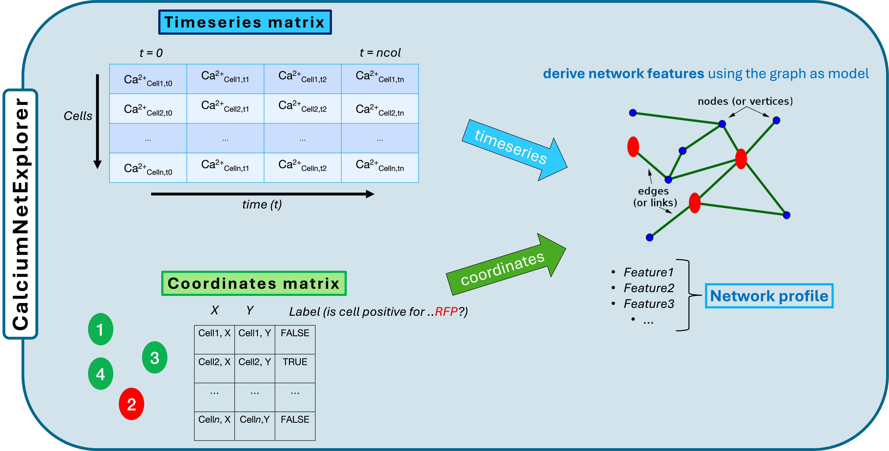

# CalciumNetExploreR

**CalciumNetExploreR** is an R package designed for comprehensive calcium imaging data analysis, including normalization, binarization, network creation, and various advanced visualizations. The package provides an integrated pipeline to streamline the analysis of calcium imaging data from live imaging experiments.

## Installation

You can install the development version of CalciumNetExploreR from GitHub using the following commands:

Install devtools if you haven't already:

`install.packages("devtools")`

The `CalciumNetExploreR` package relies on several R packages for its functionality. Make sure to install these dependencies before using `CalciumNetExploreR`. You can install these packages using the command `install.packages("package_name")`.

Here is the list of dependencies:

-   **ggplot2**: For data visualization and plotting graphs.
-   **reshape2**: For data reshaping and melting data frames.
-   **ggdendro**: For creating dendrogram plots.
-   **cowplot**: For combining multiple plots into a single plot.
-   **ggpubr**: For publication-ready plots with additional theme options.
-   **grid**: For viewport manipulation and custom plot arrangements.
-   **igraph**: For creating and analyzing networks and graphs.
-   **ggraph**: For plotting networks and graphs with ggplot2.
-   **factoextra**: For visualizing PCA results and extracting eigenvalues.
-   **dplyr**: For data manipulation and summarization.
-   **RColorBrewer**: For color palettes used in plots.
-   **Readr**: to import data from .csv files

### Installation of Dependencies

To ensure all dependencies are installed, you can run the following command:

`install.packages(c("ggplot2", "reshape2", "ggdendro", "cowplot", "ggpubr", "grid", "ggraph", "igraph", "factoextra", "dplyr", "RColorBrewer", "readr"))`

## Install CalNetExploreR from GitHub

`devtools::install_github("simo-91/CalNetExploreR")`

## Usage



To use the main functions you need a matrix containing your timeseries data. Every row should be a different cell/timeseries and it should looks something like this:

| Timepoint n~0~ | Timepoint 2 | Timepoint 3 | ... | Timepoint n~max~ |
|:--------------:|:-----------:|:-----------:|:---:|:----------------:|
|      0.12      |    0.23     |    0.35     | ... |       0.31       |
|      0.11      |    0.19     |    0.22     | ... |       0.40       |
|      0.09      |    0.15     |    0.18     | ... |       0.42       |
|      0.14      |    0.21     |    0.30     | ... |       0.37       |
|      0.13      |    0.20     |    0.25     | ... |       0.43       |
|      0.08      |    0.12     |    0.16     | ... |       0.39       |
|      0.10      |    0.18     |    0.23     | ... |       0.40       |

Some of the functions require cell coordinates (X and Y) stored in a matrix. This should have X, Y and Cell ID columns, e.g.:

|  X   |  Y   | Cell ID |
|:----:|:----:|:-------:|
| 12.5 | 23.8 |    1    |
| 14.1 | 25.3 |    2    |
| 10.2 | 22.7 |    3    |
| 13.7 | 20.9 |    4    |
| 15.4 | 18.5 |    5    |
| 11.8 | 19.3 |    6    |
| 16.2 | 21.4 |    7    |
| ...  | ...  |   ...   |

## Usage example:

```         
# Load the package

library(CalNetExploreR)

# Example data: Generate a random calcium matrix and coordinates
    
calcium_matrix <- matrix(runif(1000), nrow = 10)  
coordinates <- data.frame(X = runif(10), Y = runif(10), Cell = 1:10)

# Run the full analysis pipeline
results <- pipeline(
  calcium_matrix = calcium_matrix,
  coordinates = coordinates,
  dendrogram = TRUE,
  correlation_threshold = 0.3,
  frame_rate = 0.5,
  lag.max = 1,
  big_community_min_members = 5,
  samplename = "example_sample"
)

# Access the results
print(results$population_activity_plot)  # View population activity plot
print(results$network_plot)             # View network plot
print(results$degree_plot)              # View degree distribution plot


# Population Activity Plot with a dendrogram
population_plot <- population_activity(binarized_calcium_matrix = results$binarized_matrix, binarize = FALSE, dendrogram = TRUE)
print(population_plot)

# PCA Analysis with a scree plot
pca_result <- pca(calcium_matrix = results$normalized_matrix, binarize = FALSE, plot = TRUE)
print(pca_result)

# Create a network from the binarized matrix
network <- make_network(binarized_calcium_matrix = results$binarized_matrix, lag.max = 1, correlation_threshold = 0.3)

# Plot the network with community labels
network_plot <- plot_network(graph = network, coordinates = coordinates, label = "communities", correlation_threshold = 0.3)
print(network_plot)

# Degree Distribution Plot
degree_plot <- degrees(graph = network, plot = TRUE)
print(degree_plot)

# Power Spectral Density Analysis Plot
psd_plot <- PSD.plt(calcium_matrix = results$normalized_matrix, binarize = FALSE, frame_rate = 0.5)
print(psd_plot)

# Calculate events per minute
events_per_min_results <- events_per_min(calcium_matrix = results$binarized_matrix)
print(events_per_min_results)
```


## Main Features

**CalNetExploreR** provides a comprehensive suite of tools for analyzing calcium imaging data and exploring neuronal networks. The main features include:

**Normalization (`normalize.R`)**
- Standardize calcium imaging data to a common scale for consistent analysis across cells and experiments.

**Binarization (`binarize.R`)**
- Convert normalized data to binary states to facilitate activity analysis by distinguishing active from inactive states.

**Population Activity Analysis and Visualization (`population_activity.R`, `coactive_cells.R`, `active_cells_percentage.R`)**
- **Hierarchical Clustering and Heatmaps**: Sort and display cell activity over time using hierarchical clustering, with optional dendrogram visualization.
- **Coactive Cells Identification**: Calculate the percentage of coactive cells at each time point to assess synchronous activity across the population.
- **Active Cells Percentage Calculation**: Compute the percentage of active cells over time to analyze overall population dynamics.

**Event Frequency Analysis (`events_per_min.R`)**
- Calculate the frequency of events per minute for each cell, providing insights into individual cellular activity levels.

**Network Construction and Visualization (`make_network.R`, `plot_network.R`)**
- **Network Creation**: Generate a network of cell interactions based on cross-correlation and specified lag times to infer functional connectivity.
- **Network Visualization**: Visualize the network structure using graph plotting functions to understand connectivity patterns and community structures.

**Network Feature Extraction (`network_features.R`, `degrees.R`)**
- **Graph Theoretical Measures**: Analyze network properties such as degree distribution, clustering coefficients, path lengths, and modularity to characterize the network's topology.
- **Degree Distribution Analysis**: Examine the distribution of connections per node (cell) to identify hubs and network hierarchy.

**Principal Component Analysis (PCA) (`pca.R`, `get_top5pc_variance.R`)**
- **Dimensionality Reduction**: Perform PCA to reduce data dimensionality and identify principal components that capture the most variance.
- **Variance Analysis**: Extract and visualize the variance explained by the top principal components using scree plots to aid in component selection.

**Power Spectral Density (PSD) Analysis (`PSD.R`, `PSD.plt.R`)**
- **Frequency Analysis**: Conduct PSD analysis on calcium signals to examine the spectral content and identify dominant frequencies in the data.
- **PSD Plotting**: Generate plots of the power spectral density to visualize frequency components.

**Subset Extraction and Analysis (`get_subset.R`, `subset_connections.R`)**
- **Data Subsetting**: Extract subsets of data based on specific criteria (e.g., cell types, regions) for focused analysis.
- **Connection Subsetting**: Filter network connections to analyze specific interactions or sub-networks of interest.

**Analysis of Labeled to Unlabeled Connections (`labeled_to_nonlabeled_connections.R`, `labeled_to_nonlabeled_connections_normalized.R`)**
- Analyze and quantify the connections between labeled (e.g., genetically or chemically tagged) and unlabeled cells within the network, both in raw counts and normalized forms.

**Degree-Based Subsetting (`degrees.R`)**
- Identify cells with specific degree properties (e.g., high-degree hubs) for targeted analysis of their roles within the network.

**Full Analysis Pipeline Execution (`full_pipeline.R`)**
- Execute the entire analysis workflow with a single function, streamlining the process from raw data to results, including normalization, binarization, network construction, and feature extraction.


For more information, please refer to the manual (CalNetExploreR.pdf)

## License

This package is open-source and available under the MIT License.
